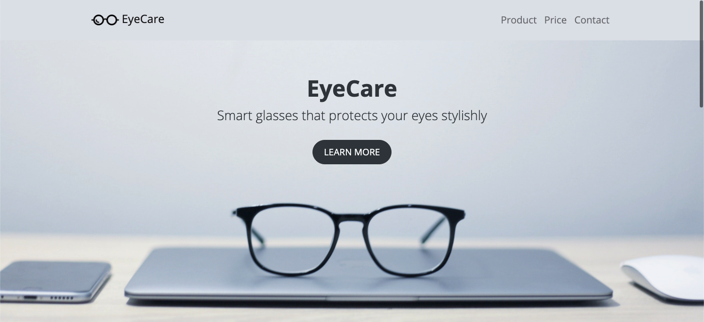
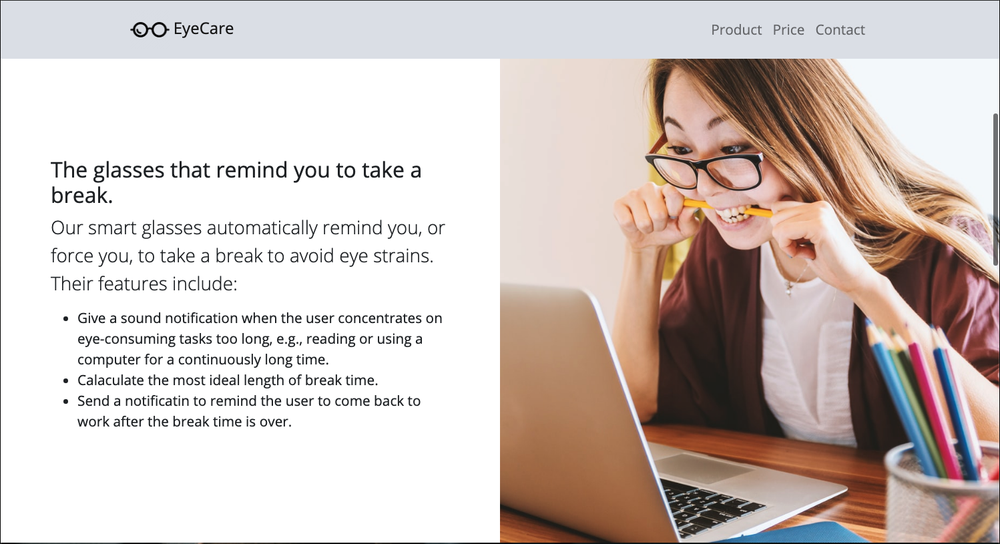
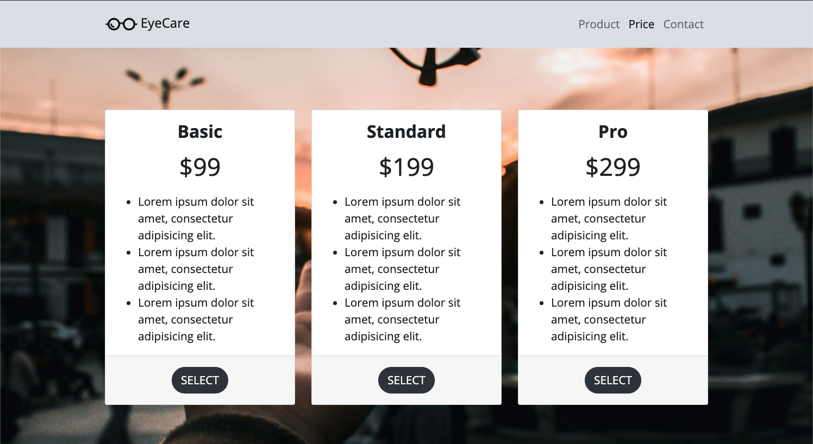

## A startup landing page demo: EyeCare
----
<em>The landing page is bootstrapped with the the template provided by "Start Bootstrap": https://github.com/StartBootstrap/startbootstrap-scrolling-nav  </em>
<strong>A demo of responsive landing page for a (imaginary) startup product "smart glasses". The page includes:</strong>
* navbar
* header
* product
* price
* contact  

The landing page is tailored to display/operate on different screen sizes, e.g., laptops, tablets, and smart phones, etc.

